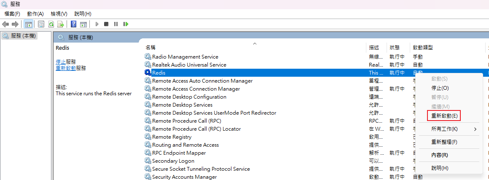

# RedisKeyspaceNotifications
使用 StackExchange.Redis 庫在 C# 中監聽 Redis Keyspace Notifications 的程式碼範例，並且設定監聽的 key 為 "eventnews"  

# 介紹
1. Keyspace Notifications:  
- Keyspace Notifications 允許您監聽 Redis 數據庫中 key 的變化情況，如 key 的設置（set）、刪除（del）、過期（expire）等事件。
- 通過 Keyspace Notifications，您可以實現對特定 key 的變化進行監控，並在特定事件發生時接收通知。
- Keyspace Notifications 更適合用於監控單個 key 的變化，以實現細粒度的監控和操作。

2. PUBLISH(發佈) 和 SUBSCRIBE(訂閱):

- PUBLISH 和 SUBSCRIBE 是 Redis 中的發布-訂閱模式，用於實現消息的發布和訂閱功能。
- 通過 PUBLISH 命令將消息發布到指定的頻道，而通過 SUBSCRIBE 命令訂閱一個或多個頻道，從而接收相應的消息通知。
- PUBLISH 和 SUBSCRIBE 更適合用於實現消息的廣播和訂閱，例如實時數據推送、即時通訊等場景。

# Redis 設置
C:\Program Files\Redis\redis.windows-service.conf 搜尋 notify-keyspace-events 並修改為 KEA  
```config
notify-keyspace-events "KEA"
```
修改完配置後，保存文件並重新啟動 Redis 服務，讓新的配置生效。
Win+R 輸入 services.msc 開啟服務管理員，找到 Redis 服務，右鍵選取重新啟動。  


# 持久化到磁盤
您可以配置 redis.windows-service.conf 檔案，使 Redis 將數據持久化到磁盤，以便在重新啟動後加載之前的數據。
```
appendonly yes
```